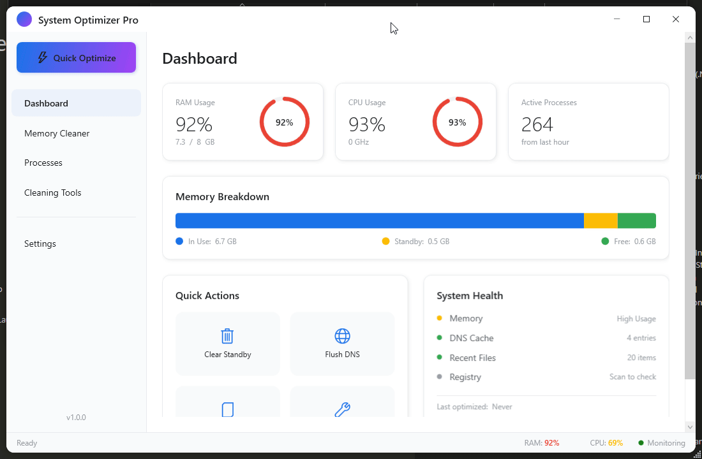

# System Optimizer Pro
Inspired by [Intelligent Standby List Cleaner (ISLC)](https://www.wagnardsoft.com/forums/viewtopic.php?t=1256)


**Created by ZxPwd**  
Discord: `zxpwd`

---



A modern Windows system optimization and memory management application built with WPF and .NET 8.0.

## Changelog

### v1.1.0
- **Registry Cleaner Fix** - Fixed the registry cleaner to actually remove issues when cleaning
- **Dashboard Action Log** - Added action log section showing recent optimization actions with timestamps
- **Persistent Action Log** - Action log now persists when switching between tabs
- **System Health Colors** - Improved health indicator colors (green for good, orange for moderate, red for critical)
- **Dangerous Process Highlighting** - Critical system processes are now highlighted in red in Process Manager
- **Process Protection Tooltips** - Added warning tooltips for dangerous processes

### v1.0.0
- Initial release with memory management, system cleaning, and process management features

---

## Features

### Memory Management
- **Real-time RAM Monitoring** - Live display of memory usage with historical charts
- **Standby List Cleaner** - ISLC-style memory purging to free up standby memory
- **Auto-Purge Mode** - Automatically clears standby memory when thresholds are met
- **Memory Statistics** - Detailed breakdown of physical, virtual, and standby memory

### System Cleaning
- **DNS Cache Flushing** - Clear DNS resolver cache with one click
- **Recent Files Cleaner** - Remove recent file history for privacy
- **Registry Cleaner** - Full registry scanner with safe cleaning:
  - Invalid file associations
  - Obsolete software entries
  - Invalid shared DLLs
  - Invalid startup entries
  - MRU (Most Recently Used) lists

### Process Manager
- **Live Process List** - Real-time view of all running processes
- **CPU & Memory Usage** - Per-process resource consumption
- **Dangerous Process Protection** - Critical system processes highlighted in red to prevent accidental termination
- **Process Termination** - End process or entire process tree
- **File Location** - Quick access to process executable location

### Dashboard
- **Real-time CPU Monitoring** - Live CPU usage with historical chart
- **Memory Overview** - Visual memory usage breakdown
- **System Information** - OS version, uptime, and hardware details
- **Quick Actions** - One-click access to common optimization tasks

### Additional Features
- **System Tray Support** - Minimize to tray for background operation
- **Windows Startup** - Option to start with Windows
- **Modern Light Theme** - Clean, professional UI design
- **Single-File Deployment** - Portable executable with no dependencies

## Core Inspiration

This application is inspired by **Intelligent Standby List Cleaner (ISLC)** by Wagnard but extends functionality with:

- Modern WPF custom UI (light theme)
- Additional system cleaning features
- Real-time resource monitoring dashboard
- Process management capabilities

## Requirements

- **Operating System**: Windows 10/11 (64-bit)
- **Runtime**: .NET 8.0 Runtime (included in standalone build)
- **Permissions**: Administrator privileges required for memory operations

## Installation

### Option 1: Standalone Executable (Recommended)
1. Download `SystemOptimizerPro.zip` from the [Releases](../../releases) page
2. Extract the ZIP file
3. Run `SystemOptimizerPro.exe` as Administrator

### Option 2: Build from Source
```bash
# Clone the repository
git clone https://github.com/YOUR_USERNAME/SystemOptimizerPro.git
cd SystemOptimizerPro

# Restore dependencies
dotnet restore

# Build
dotnet build -c Release

# Or publish as single file
dotnet publish src/SystemOptimizerPro/SystemOptimizerPro.csproj -c Release -r win-x64 --self-contained true -p:PublishSingleFile=true -o ./publish
```

## Usage

### Memory Cleaner
1. Navigate to the **Memory Cleaner** tab
2. View current memory statistics
3. Click **Clear Standby List** to free memory
4. Enable **Auto-Purge** in settings for automatic cleaning

### Registry Cleaner
1. Navigate to the **Cleaning Tools** tab
2. Click **Scan Registry** to find issues
3. Review found issues (selecting which to clean)
4. Click **Clean Selected** to fix issues
5. A backup is automatically created before cleaning

### Process Manager
1. Navigate to the **Processes** tab
2. View running processes sorted by memory usage
3. **Red highlighted rows** = System processes (DO NOT terminate)
4. Select a process and click **End Process** to terminate

### Settings
- **Start with Windows** - Launch on Windows startup
- **Start Minimized** - Start in system tray
- **Auto-Purge** - Configure automatic memory cleaning thresholds
- **Registry Backup** - Always create backup before cleaning

## Screenshots

The application features a modern light theme with intuitive navigation:

- **Dashboard** - System overview with real-time charts
- **Memory Cleaner** - Detailed memory statistics and controls
- **Processes** - Full process manager with protection indicators
- **Cleaning Tools** - DNS, recent files, and registry cleaning
- **Settings** - Customizable preferences and auto-purge configuration

## Technical Details

### Built With
- **.NET 8.0** - Modern runtime with performance improvements
- **WPF** - Windows Presentation Foundation for rich UI
- **CommunityToolkit.Mvvm** - MVVM pattern implementation
- **LiveChartsCore** - Real-time charting library
- **Hardcodet.NotifyIcon.Wpf** - System tray support

### Architecture
- **MVVM Pattern** - Clean separation of concerns
- **Dependency Injection** - Loosely coupled components
- **Native Interop** - Direct Windows API calls for system operations

### Windows APIs Used
- `NtSetSystemInformation` - Standby list purging
- `GlobalMemoryStatusEx` - Memory information
- `GetPerformanceInfo` - System performance data
- `DnsFlushResolverCache` - DNS cache operations

## Safety Features

- **Process Protection** - Critical system processes are highlighted in red and display a warning tooltip
- **Registry Backup** - Automatic backup creation before any registry modifications
- **Confirmation Dialogs** - Optional confirmation before cleaning operations
- **Non-destructive Scanning** - Registry scan is read-only until you choose to clean

## Contributing

Contributions are welcome! Please feel free to submit a Pull Request.

1. Fork the repository
2. Create your feature branch (`git checkout -b feature/AmazingFeature`)
3. Commit your changes (`git commit -m 'Add some AmazingFeature'`)
4. Push to the branch (`git push origin feature/AmazingFeature`)
5. Open a Pull Request

## License

This project is licensed under the MIT License - see the [LICENSE](LICENSE) file for details.

```
MIT License

Copyright (c) 2024 ZxPwd

Permission is hereby granted, free of charge, to any person obtaining a copy
of this software and associated documentation files (the "Software"), to deal
in the Software without restriction, including without limitation the rights
to use, copy, modify, merge, publish, distribute, sublicense, and/or sell
copies of the Software, and to permit persons to whom the Software is
furnished to do so, subject to the following conditions:

The above copyright notice and this permission notice shall be included in all
copies or substantial portions of the Software.

THE SOFTWARE IS PROVIDED "AS IS", WITHOUT WARRANTY OF ANY KIND, EXPRESS OR
IMPLIED, INCLUDING BUT NOT LIMITED TO THE WARRANTIES OF MERCHANTABILITY,
FITNESS FOR A PARTICULAR PURPOSE AND NONINFRINGEMENT. IN NO EVENT SHALL THE
AUTHORS OR COPYRIGHT HOLDERS BE LIABLE FOR ANY CLAIM, DAMAGES OR OTHER
LIABILITY, WHETHER IN AN ACTION OF CONTRACT, TORT OR OTHERWISE, ARISING FROM,
OUT OF OR IN CONNECTION WITH THE SOFTWARE OR THE USE OR OTHER DEALINGS IN THE
SOFTWARE.
```

## Author

**Created by ZxPwd**

## Acknowledgments

- [Intelligent Standby List Cleaner (ISLC)](https://www.wagnardsoft.com/forums/viewtopic.php?t=1256) by Wagnard - Original inspiration for standby list cleaning
- [CommunityToolkit.Mvvm](https://github.com/CommunityToolkit/dotnet) - MVVM implementation
- [LiveCharts2](https://github.com/beto-rodriguez/LiveCharts2) - Charting library
- [Hardcodet.NotifyIcon.Wpf](https://github.com/hardcodet/wpf-notifyicon) - System tray support

---

**Note**: This application requires administrator privileges to perform memory management and registry operations. Always run as Administrator for full functionality.
